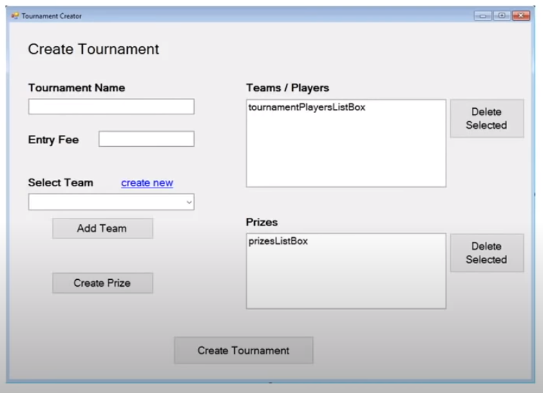
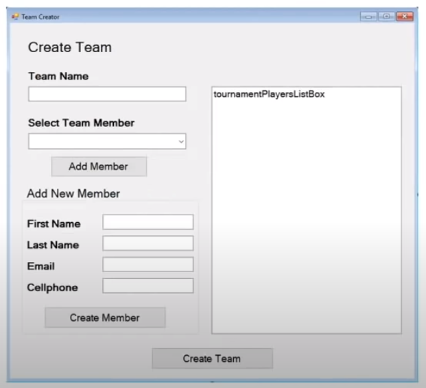
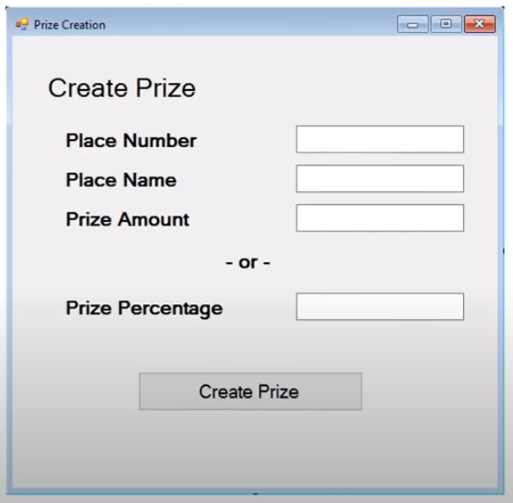
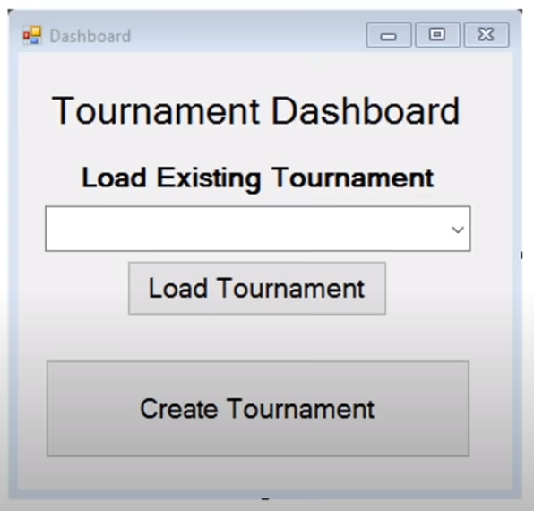
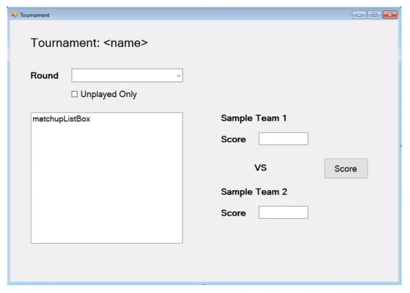

# Torunament Tracker

## DESCRIPTION

This is a tournament tracking application, to determine who is the best at playing a basketball game.
The idea is to create a bracket tournament system where the computer will tell them who to play in a single-elimination style bracket.
At the end, the winner should be identified. Their model is the NCAA Basketball tournament bracket for March Maddness.

---

## PLANNING STEP 1

1. Tracks games played and ther outcome (who won).
2. Multiple competitors play the tournament.
3. Creates a tournament plan (who plays in what order).
4. Schedules games.
5. A single loss eliminates a player from the tournament.
6. The last player standing is the winner.

### QUESTIONS

1. How many players will the tournament handle? Is it variable?
2. If a tournament has less than the full complement of players, how do we handle it?
3. Should the ordering of who plays each other be random or ordered by input order?
4. Should we schedule the games or are they just played whenever?
5. If the games are scheduled, how does the system know when to schedule games for?
6. If the games are played whenever, can a game from the second round be played before the first round is complete?
7. Does the system need to store a score of some kind or just who won?
8. What type of front-end should this system have (Winform, webpage, mobile app, etc.)?
9. Where will the data be stored?
10. Will this system handle entry fees, prizes, or other payouts?
11. What type of reporting is needed?
12. Who can fill in the results of a game?
13. Are there varying levels of access?
14. Should this system contact users about upcoming games?
15. Is each player on their own or can teams use this tournament tracker?

---

## OVERVIEW PLANNING

Q: How many players will the tournament handle? Is it variable?  
A: The application should be able to handle a variable number of players in a tournament.

Q: If a tournament has less than the full complement of players, how do we handle it?  
A: A trournament with less than the perfect number (a multiple of 2, so 4, 8, 16, 32, etc.) should add in "byes".  
Basically, certain people selected at random get to skip the first round and act as if they won.

Q: Should the ordering of who plays each other be random or ordered by input order?  
A: The ordering of the tournament should be random.

Q: Should we schedule the games or are they just played whenever?  
A: The games should be played in whatever order and whenever the players want to play them.

Q: If the games are scheduled, how does the system know when to schedule games for?  
A: They are not scheduled so we do not care.

Q: If the games are played whenever, can a game from the second round be played before the first round is complete?  
A: No. Each round schould be fully completed before the next round is displayed.

Q: Does the system need to store a score of some kind or just who won?  
A: Storing a simple score would be nice. Just a number for each player.  
That way, the tracker can be flexible enough to handle a checkers tournament (the winner would have a 1 and the loser a 0) or a basketball tournament.

Q: What type of front-end should this system have (Winform, webpage, mobile app, etc.)?  
A: The system should be a desktop system for now, but down the road we might want to turn it into an app or a website.

Q: Where will the data be stored?  
A: Ideally, the data should be stored in a Microsoft SQL database but please put in an option to store to a text file instead.

Q: Will this system handle entry fees, prizes, or other payouts?  
A: Yes. The tournament should have the option of charging an entry fee.  
Prizes should also be an option, where the tournament administrator chooses how much money to award a variable number of places.  
The total cash amount should not exceed the income from the tournament. A percentage-based system would also be nice to specify.

Q: What type of reporting is needed?  
A: A simple report specifying the outcome of the games per round as well as a report that specifies who won and how much they won.  
These can be just displayed on a form or they can be emailed to tournament competitors and the administrator.

Q: Who can fill in the results of a game?  
A: Anyone using the application should be able to fill in the game scores.

Q: Are there varying levels of access?  
A: No. The only method of varied access is if the competitors are not allowed into the application and instead, they do everything via email.

Q: Should this system contact users about upcoming games?  
A: Yes, the system should email users that they are due to play in a round as wel as who they are scheduled to play.

Q: Is each player on their own or can teams use this tournament tracker?  
A: The tournament tracker should be able to handle the addition of other members.  
All members should be treated as equals in that they all get tournament emails.  
Teams should also be able to name their team.

---

## BIG PICTURE DESIGN

1. STRUCTURE: Windows Forms application and Class Library
2. DATA: SQL and/or Text File
3. USERS: One at a time on one application

---

## KEY CONCEPTS

- Email - how will I do that? How can I send an email?
- SQL - how to access data?
- Custom Events
- Error Handling - we can't trust the user to give correct information all the time
- Interfaces - pass information back and forth
- Random Ordering - how to randomize information, how to shuffle a list, how to generate random numbers
- Texting - capture names, email addresses, phone numbers and other information to generate texts

---

## DATA DESIGN - MAPPING THE DATA

1. Team
   - TeamMembers (List\<Person>)
   - TeamName (string)

2. Person
   - FirstName (string)
   - LastName (string)
   - EmailAddress (string)
   - CellphoneNumber (string)

3. Tournament
   - TournamentName (string)
   - EntryFee (decimal)
   - EnteredTeams (List\<Teams>)
   - Prizes (List\<Prize>)
   - Rounds (List\<List\<Matchup>>)

4. Prize
   - PlaceNumber (int)
   - PlaceName (string)
   - PrizeAmount (decimal)
   - PrizePercentage (double)

5. Matchup
   - Entries (List\<MatchupEntry>)
   - Winner (Team)
   - MatchupRound (int)

6. MatchupEntry
   - TeamCompeting (Team)
   - Score (double)
   - ParentMatchup (Matchup)

---

## USER INTERFACE DESIGN AND LOGIC PLANNING

### Create Tournament

1. Create New  
   - create a new team -> open up Create Team Form  
   - after creating a team we would want to return to the Create Tournament Form
   - show the created team in Team/Players (tournamentPlayersListBox) listbox.

2. Add Team  
   - going to look at the Select Team dropdown list and put the selected item into the Team/Players (tournamentPlayersListBox) listbox
   - once is done we need to update the dropdown list - clear the dropdown list and remove the added team or player from the list

3. Create Prize  
   - create new prize -> open up the Create Prize Form
   - show the created prizes in the Prizes (prizesListBox) listbox

4. Delete Selected  
   - delete a selected item from the listbox
   - in the Team/Player listbox there will be an additional step to put back the item to the Select Team dropdown list

5. Create Tournament  
   - first we need to validate all the information  
      + make shure there is a trournament name and it is not used already
	  + make shure the Entry Fee isn't a negative number
	  + make shure we have at least two teams 
   - second we have to create a schedule - the Tournament.Rounds list will be populated here

### Create Team

1. Add Member
   - take an existing team member from the Select Team Member dropdown list and add it to the tournamentPlayersListBox
   - remove the member from the Select Team Member dropdown list

2. Create Member
   - validate the First Name, Last Name, Email and Cellphone information
   - add the member to the tournamentPlayersListBox
   - clear out the First Name, Last Name, Email and Cellphone fields

3. Delete Member
   - delete the selected member from the tournamentPlayersListBox [^1]

4. Create Team
   - validate the team and create it
   - send information back to the caller

### Create Prize

1. Create Prize
   - validate the Place Number, Place Name, Prize Amount and/or Prize Percentage fields
   - send the information back to the calling form

### Tournament Dashboard

1. Load Tournament
   - loads the selected tournament from the Load Existing Tournament dropdown list and opens the Tournament Viewer window

2. Create Tournament
   - opens the Create Torunament Form
   - after the Create Tournament Form closes we have to return the created tournament and add it to the Load Existing Tournament dropdown list

### Tournament Viewer

1. Tournament: \<name>
   - gets updated when we load a tournament

2. Round
   - this dropdown list is calculated
   - it uses the Tournament.Rounds object to calculate how many rounds are in the Tournament.Rounds object
   - if a tournament has 4 rounds we have to display in this dropdown list Round 1, Round 2, Round 3 and Round 4
   - this dropdown will change what the matchupListBox shows

3. Unplayed Only
   - filter the matchupListBox to show only the unplayed matches by the round selected in the Round dropdown list

4. Score fields
   - Sample Team 1 and Sample Team 2 will be updated to show the team or player names
   - if the team has a score it will show it in the Score field otherwise it will be empty

5. Score
   - saves the matchup scores and finalize and say that matchup is over and who is the winner 
   - after the scoring we gonna have to figure out some way of triggering then other things based upon a matchup being scored
   - f.e. if this is the last game in the round, hitting the Score button should trigger the next round
   - email people when they schedule to play
   - email out the result of the round
   - if this is the last game in the last round (champion game) we trigger the end of tournament information
     + assign prizes
	 + trigger final email with who won, who got what prize and what are the results of the complete tournament

### Other Pieces

- data access - how we gonna access the data, store the data, how we gonna deal with t two diferent data sources (SQL and CSV)
- how we gonna email out information, what triggers that
- what triggers knowing who will play the next matchup

[^1]: ! have to add a Delete Member button to the Create Team form
