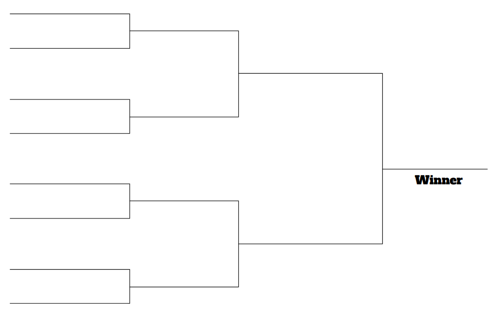

# Torunament Tracker

## DESCRIPTION

This is a tournament tracking application, to determine who is the best at playing a basketball game.
The idea is to create a bracket tournament system where the computer will tell them who to play in a single-elimination style bracket.
At the end, the winner should be identified. Their model is the NCAA Basketball tournament bracket for March Maddness.

## PLANNING STEP 1

1. Tracks games played and ther outcome (who won).
2. Multiple competitors play the tournament.
3. Creates a tournament plan (who plays in what order).
4. Schedules games.
5. A single loss eliminates a player from the tournament.
6. The last player standing is the winner.

### QUESTIONS

1. How many players will the tournament handle? Is it variable?
2. If a tournament has less than the full complement of players, how do we handle it?
3. Should the ordering of who plays each other be random or ordered by input order?
4. Should we schedule the games or are they just played whenever?
5. If the games are scheduled, how does the system know when to schedule games for?
6. If the games are played whenever, can a game from the second round be played before the first round is complete?
7. Does the system need to store a score of some kind or just who won?
8. What type of front-end should this system have (Winform, webpage, mobile app, etc.)?
9. Where will the data be stored?
10. Will this system handle entry fees, prizes, or other payouts?
11. What type of reporting is needed?
12. Who can fill in the results of a game?
13. Are there varying levels of access?
14. Should this system contact users about upcoming games?
15. Is each player on their own or can teams use this tournament tracker?

## OVERVIEW PLANNING

Q: How many players will the tournament handle? Is it variable?  
A: The application should be able to handle a variable number of players in a tournament.

Q: If a tournament has less than the full complement of players, how do we handle it?  
A: A trournament with less than the perfect number (a multiple of 2, so 4, 8, 16, 32, etc.) should add in "byes".  
Basically, certain people selected at random get to skip the first round and act as if they won.

Q: Should the ordering of who plays each other be random or ordered by input order?  
A: The ordering of the tournament should be random.

Q: Should we schedule the games or are they just played whenever?  
A: The games should be played in whatever order and whenever the players want to play them.

Q: If the games are scheduled, how does the system know when to schedule games for?  
A: They are not scheduled so we do not care.

Q: If the games are played whenever, can a game from the second round be played before the first round is complete?  
A: No. Each round schould be fully completed before the next round is displayed.

Q: Does the system need to store a score of some kind or just who won?  
A: Storing a simple score would be nice. Just a number for each player.  
That way, the tracker can be flexible enough to handle a checkers tournament (the winner would have a 1 and the loser a 0) or a basketball tournament.

Q: What type of front-end should this system have (Winform, webpage, mobile app, etc.)?  
A: The system should be a desktop system for now, but down the road we might want to turn it into an app or a website.

Q: Where will the data be stored?  
A: Ideally, the data should be stored in a Microsoft SQL database but please put in an option to store to a text file instead.

Q: Will this system handle entry fees, prizes, or other payouts?  
A: Yes. The tournament should have the option of charging an entry fee.  
Prizes should also be an option, where the tournament administrator chooses how much money to award a variable number of places.  
The total cash amount should not exceed the income from the tournament. A percentage-based system would also be nice to specify.

Q: What type of reporting is needed?  
A: A simple report specifying the outcome of the games per round as well as a report that specifies who won and how much they won.  
These can be just displayed on a form or they can be emailed to tournament competitors and the administrator.

Q: Who can fill in the results of a game?  
A: Anyone using the application should be able to fill in the game scores.

Q: Are there varying levels of access?  
A: No. The only method of varied access is if the competitors are not allowed into the application and instead, they do everything via email.

Q: Should this system contact users about upcoming games?  
A: Yes, the system should email users that they are due to play in a round as wel as who they are scheduled to play.

Q: Is each player on their own or can teams use this tournament tracker?  
A: The tournament tracker should be able to handle the addition of other members.  
All members should be treated as equals in that they all get tournament emails.  
Teams should also be able to name their team.

## BIG PICTURE DESIGN

